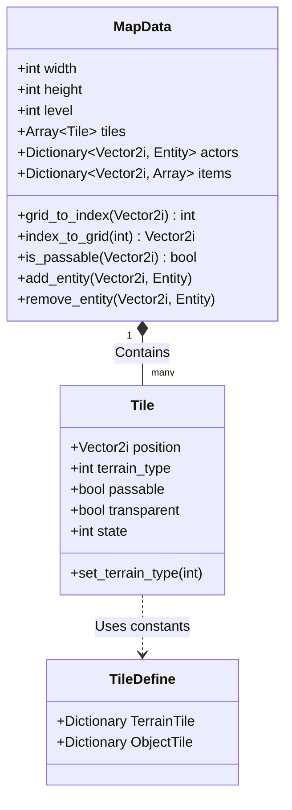
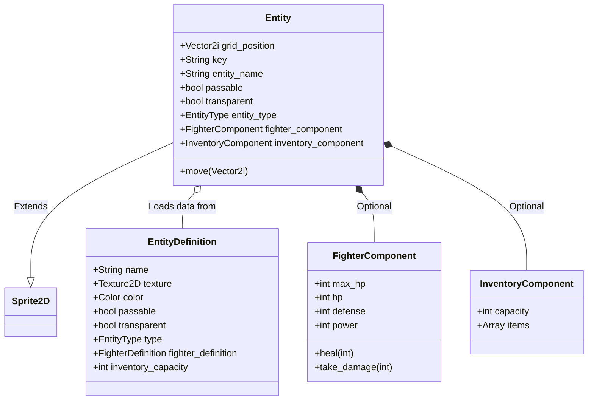

# データ構造ドキュメント

このドキュメントでは、`sukoshi-dungeon` プロジェクトにおける主要なデータ構造について解説します。
ゲームの中核となるマップシステムとエンティティシステムを中心に記述します。

## マップシステム

マップシステムは、グリッド状の地形データと、その上に配置されるオブジェクトを管理します。

### クラス図 (Mermaid)

### 主要クラス解説

#### MapData (`scripts/Map/map_data.gd`)

ゲームマップの状態を保持する中心的なクラスです。
`tiles` 配列にすべてのタイルデータを1次元配列として保持しており、`actors` と `items` の辞書で動的なオブジェクトの位置を管理します。

*   **tiles**: `Tile` オブジェクトの1次元配列。インデックスは `x + y * width` で計算されます。
*   **actors**: キーがグリッド座標 (`Vector2i`)、値が `Entity` オブジェクトの辞書。主にプレイヤーや敵キャラクターを管理します。
*   **items**: キーがグリッド座標 (`Vector2i`)、値が `Entity` の配列の辞書。1つのタイルに複数のアイテムが落ちている可能性があるため、配列になっています。

#### Tile (`scripts/Map/tile.gd`)

マップ上の1マスを表すクラスです。

*   **terrain_type**: 地形の種類（床、壁など）。`Enum.TerrainTileType` で定義されます。
*   **passable**: 通行可能かどうか。
*   **transparent**: 視線が通るかどうか（FOV計算に使用）。
*   **state**: タイルの可視状態（`VISIBLE`, `HIDDEN` など）。

#### TileDefine (`scripts/Map/tile_define.gd`)

タイルのグラフィック情報（Atlas座標など）を定数として定義するクラスです。
`TerrainTile`（地形）と `ObjectTile`（階段など）の定義が含まれています。

---

## エンティティシステム

エンティティシステムは、マップ上に存在するすべての動的なオブジェクト（プレイヤー、敵、アイテム）を扱います。
コンポーネント指向のアプローチを一部採用しており、機能の拡張性を高めています。

### クラス図 (Mermaid)

### 主要クラス解説

#### Entity (`scripts/Entity/entity.gd`)

`Sprite2D` を継承し、画面上の描画と論理的な位置情報の両方を管理します。

*   **grid_position**: マップ上の論理座標。この値が変更されると、自動的に画面上の `position` も更新されます。
*   **entity_type**: エンティティの種類（`ACTOR`, `ITEM`, `CORPSE`）。
*   **components**: `fighter_component` や `inventory_component` など、エンティティの機能を提供するコンポーネントを保持します。

#### EntityDefinition (`scripts/Entity/entity_definition.gd`)

エンティティの静的なデータ（名前、基本ステータス、テクスチャなど）を定義する `Resource` です。
Godotのエディタ上で設定を行い、ランタイムで `Entity` 生成時に読み込まれます。
これにより、コードを変更せずに新しい種類のモンスターやアイテムを追加することが容易になっています。
